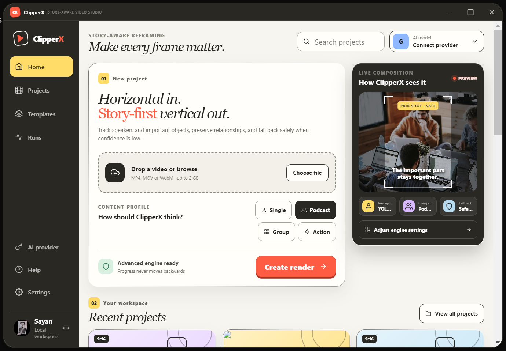
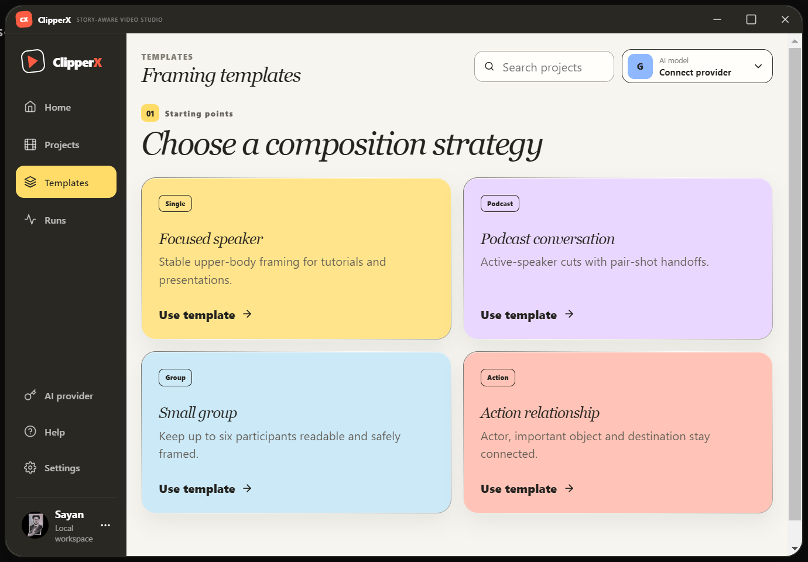
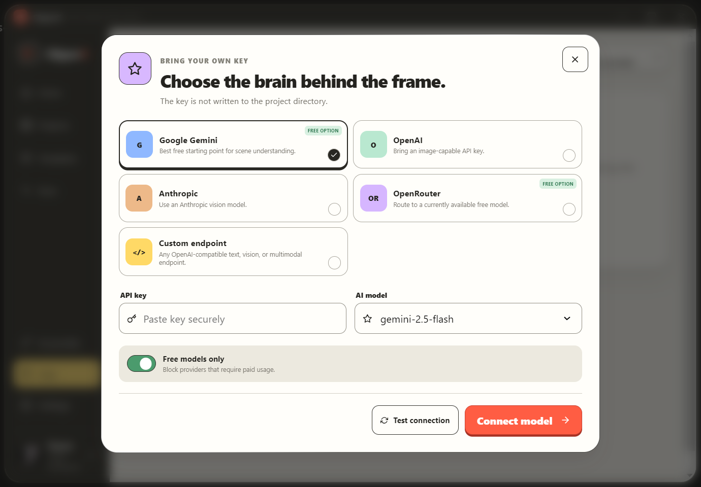

# ClipperX

**Story-aware video reframing for turning horizontal footage into intelligent vertical video.**

ClipperX is a native Electron desktop video studio backed by a local Node.js + Python engine. Instead of blindly center-cropping a landscape video, it analyzes people, speakers, objects, actions, scenes, and story relationships to plan dynamic 9:16 compositions.

> **Current direction:** story-first framing, deterministic safety, optional multimodal AI, and inspectable local processing.



## Why ClipperX?

Traditional auto-reframing often follows the loudest speaker or the largest face. That breaks down when a scene contains conversations, reactions, moving objects, sports, or important interactions happening away from the center.

ClipperX is designed around a different idea:

**Understand what matters in the scene first, then decide how to frame it.**

It combines local computer-vision and audio analysis with optional vision-model reasoning while keeping geometry and body-safety checks authoritative.

## Features

- **Story-aware reframing** — plans shots around speakers, reactions, actions, objects, and outcomes.
- **Multiple composition strategies** — Single, Podcast, Group, and Action profiles.
- **Person & object tracking** — YOLO11 detection with ByteTrack persistent identities.
- **Face & speaker intelligence** — MediaPipe faces, Faster-Whisper transcription/VAD, and optional pyannote diarization.
- **Active-speaker mapping** — associates audio speakers with visible people.
- **Scene-aware editing** — shot boundaries, story beats, dialogue locks, and stable speaker changes.
- **Dynamic 9:16 rendering** — stabilized crop keyframes plus single/shared/split/grid/action layouts.
- **Important-object preservation** — keeps relevant actors, objects, destinations, and outcomes connected.
- **Quality safeguards** — checks coverage, clipping, jitter, blank/frozen frames, subtitle collisions, and A/V drift.
- **Safe fallbacks** — conservative framing wins when an advanced crop is not sufficiently reliable.
- **Bring your own AI key** — Gemini, OpenAI, Anthropic, OpenRouter, or a custom OpenAI-compatible endpoint.
- **Local-first workflow** — the engine still works without a cloud vision key using local perception and fallback logic.
- **Inspectability** — processing artifacts and diagnostic JSON make decisions easier to debug.

## Composition Templates

ClipperX includes purpose-built starting points rather than a single universal crop strategy.



| Profile | Designed for |
| --- | --- |
| **Single** | Tutorials, presentations, talking-head footage |
| **Podcast** | Active-speaker conversations and pair-shot handoffs |
| **Group** | Keeping multiple participants readable and safely framed |
| **Action** | Preserving the relationship between an actor, important object, and destination/outcome |

## Optional AI Providers

Cloud intelligence is optional. Connect a supported image-capable model when you want additional scene/story understanding.



Supported provider paths include **Google Gemini, OpenAI, Anthropic, OpenRouter, and custom OpenAI-compatible endpoints**. API keys are used for the active job and are not written into project files.

## How It Works

```text
Video upload
   ↓
Scene detection
   ↓
YOLO + ByteTrack + face analysis
   ↓
Whisper + VAD + optional speaker diarization
   ↓
Audio-to-face active-speaker mapping
   ↓
Optional multimodal story/shot semantics
   ↓
Story + composition planning
   ↓
Trajectory-aware framing / multi-viewport layout
   ↓
Quality and safety checks
   ↓
ASS subtitles + FFmpeg final mux
   ↓
Vertical output
```

ClipperX favors a quality-first pipeline. Advanced analysis can therefore take longer than the source duration, especially on CPU-only laptops.

## Requirements

- Windows 10/11, macOS, or Linux
- Node.js 18+
- Python 3.10 or 3.11 recommended
- FFmpeg and FFprobe available on `PATH`
- 8 GB RAM recommended
- Internet connection on first run for dependencies and model weights

## Quick Start

### Windows

Fully extract the project, open Command Prompt in the project directory, then run:

```bat
npm install
python -m venv .venv
.venv\Scripts\activate
python -m pip install --upgrade pip
pip install -r requirements.txt
npm run doctor
npm run test:engine
npm run desktop
```

ClipperX opens as a dedicated desktop application. `npm run dev` remains available for browser-based development/debugging.

For a first advanced test, use a **10–30 second 720p clip**. The first run may download YOLO and Whisper model weights.

### Build the Windows installer

```bat
npm run desktop:installer
```

The generated installer is placed in `release/`.

If included in your checkout, you can also use:

```text
CREATE INSTALLABLE EXE.bat
```

## Engine Setup & Diagnostics

Before advanced processing, ClipperX checks core dependencies such as Python, FFmpeg/FFprobe, OpenCV, YOLO, Whisper, scene detection, MediaPipe, SciPy, and SoundFile.

Run a complete setup/diagnostic pass with:

```bat
npm run setup:engine
npm run doctor
```

## Optional Speaker Diarization

The default setup provides Whisper VAD and a safe single-speaker fallback. For multi-speaker pyannote diarization:

```bat
pip install -r requirements-diarization.txt
set HF_TOKEN=your_huggingface_token
```

The relevant pyannote model may require accepting its license on Hugging Face.

## Processing Artifacts

Each project keeps inspectable runtime artifacts under:

```text
runtime/projects/<id>/
```

Examples include:

```text
perception.json
audio.json
active-speakers.json
scenes.json
semantic.json
story-graph.json
composition-plan.json
crop-keyframes.json
subtitles.ass
status.json
manifest.json
output.mp4
```

These artifacts are useful for debugging why a particular subject, composition, or fallback was selected.

## Useful Commands

| Command | Purpose |
| --- | --- |
| `npm run desktop` | Launch the native desktop application |
| `npm run dev` | Run frontend + backend for development |
| `npm run dev:web` | Run frontend only |
| `npm run dev:api` | Run backend only |
| `npm run doctor` | Check the local environment |
| `npm run setup:engine` | Install/setup engine dependencies |
| `npm run test:engine` | Run Python regression tests |
| `npm run build` | Typecheck/build the frontend |
| `npm run desktop:installer` | Build the desktop installer |
| `npm run release:check` | Run release validation |

## Architecture

ClipperX has evolved into a staged story-aware directing system:

1. **Perceptual grounding** — people, faces, objects, motion, identity, and interactions.
2. **Social/audio intelligence** — speech, turns, overlaps, reactions, laughter, and visible-speaker attachment.
3. **Story intelligence** — causal roles and must-show evidence.
4. **Composition direction** — feasible single/shared/split/grid/action candidates.
5. **Sequence intelligence** — chooses a coherent camera sequence instead of greedy per-segment edits.
6. **Predictive reliability** — tests planned edits against likely future exits, dropout, jitter, and framing failures.
7. **Rendering** — stabilized cameras and multi-viewport 9:16 composition.
8. **Quality supervision** — evaluates the encoded result and permits bounded correction.
9. **Executive direction** — optional model reasoning compares routes while deterministic geometry and safety remain authoritative.

## Privacy & Reliability

ClipperX is designed so that advanced cloud analysis is **optional**. Without a vision API key, local detection, tracking, audio analysis, composition logic, and conservative fallback behavior remain available.

When a provider is connected, keys are not written to project files. Production hardening also includes bounded execution, resumable checkpoints, crash recovery, workload guards, privacy modes, diagnostics, and release validation.

## Current Status

ClipperX is an actively developed, quality-first project. Core syntax, queue wiring, deterministic planner/crop tests, and the earlier FFmpeg upload-to-render path have been validated. Heavyweight model paths depend on locally installed third-party models and should be tested on short real-world clips before larger workloads.

The project intentionally treats its benchmark and safety gates as part of the product rather than claiming that every real-world video can already be reframed perfectly.

## Screenshots

### Home / New Project


### Framing Templates


### Bring Your Own AI Provider


## License

Add your chosen license here, or include a `LICENSE` file in the repository.

---

**ClipperX — make every frame matter.**
